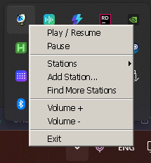
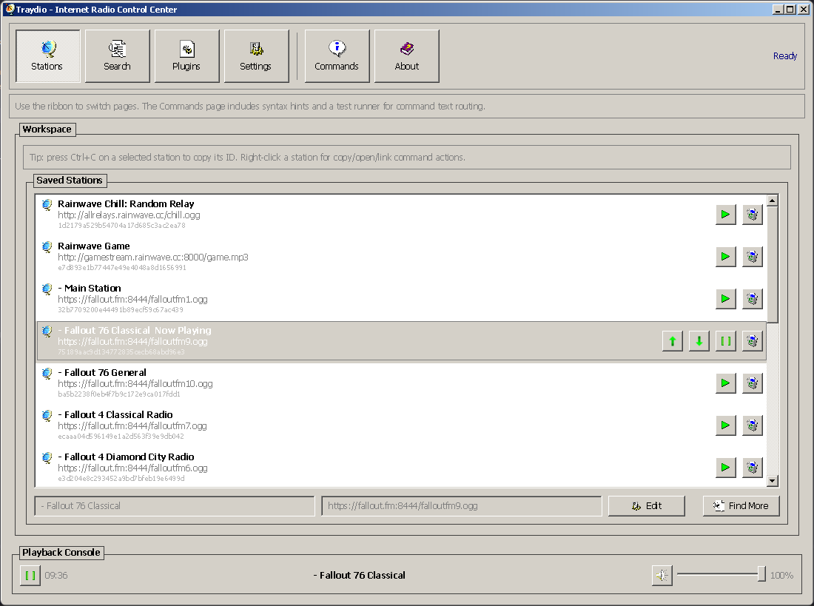
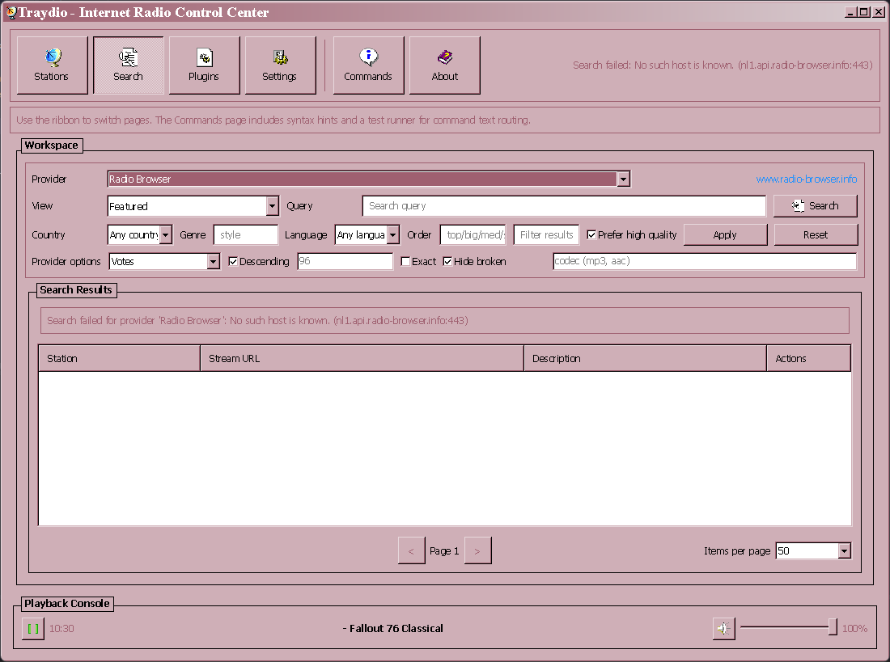
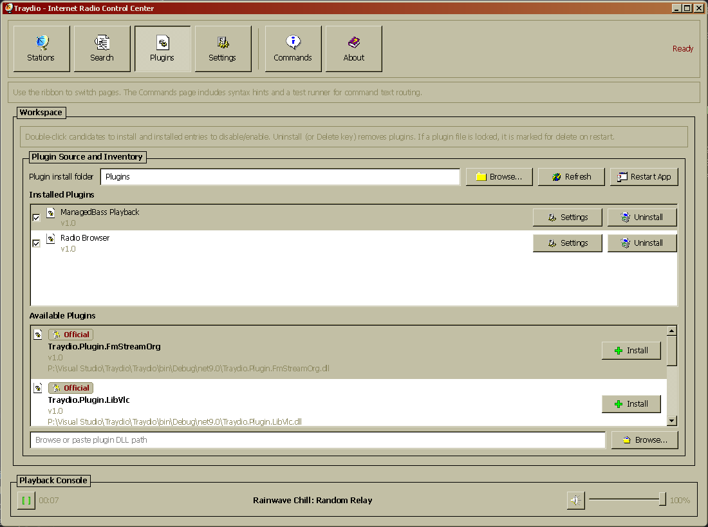
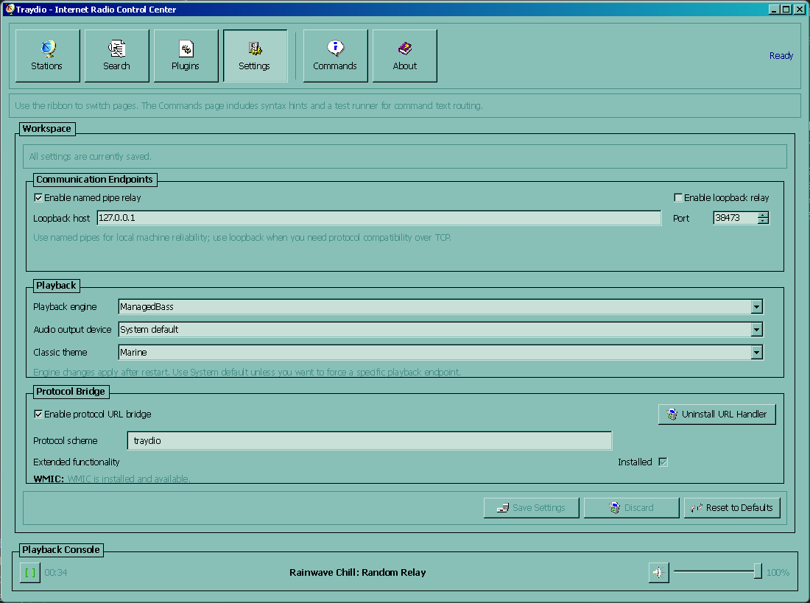
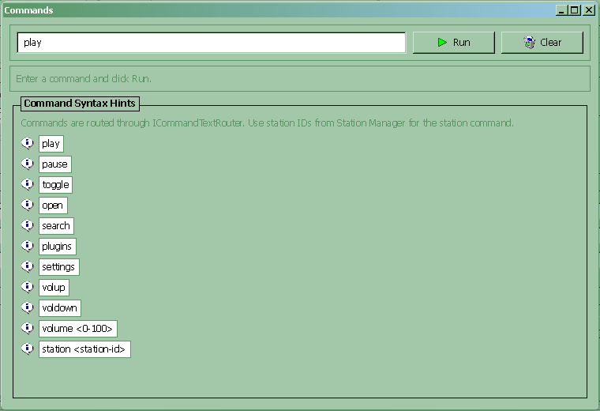
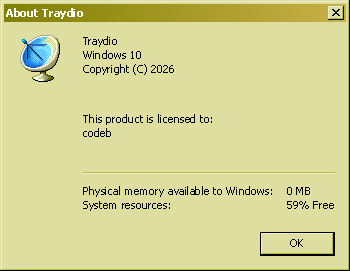
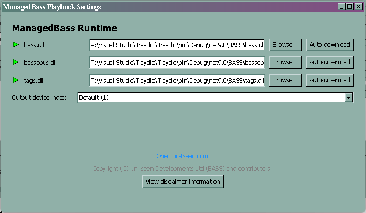

# Traydio

Traydio is an internet radio app that lives in your system tray.

It is designed to be controllable from anywhere: tray menu actions, command-line invocations, custom URI links, and external tooling (for example, a Stream Deck plugin) can all route through the same command pipeline.

The project also has a plugin-first architecture for playback engines and station discovery providers, so you can extend how audio plays and where stations come from.

## What Traydio does

- Runs tray-first so playback controls are always close at hand.
- Stores your station list and app settings locally.
- Supports station discovery through provider plugins.
- Supports multiple playback engines via plugin capabilities.
- Exposes command and relay surfaces for automation/integration.

## Quick start (users)

### 1) Prerequisites

- Windows 10/11 recommended (best-supported platform today).
- .NET 9 SDK (project targets `net9.0`).

### 2) Run the app

```powershell
dotnet run --project ".\Traydio\Traydio.csproj"
```

### 3) First-time setup

1. Open the tray icon menu.
2. Open **Station Manager** and add at least one station URL.
3. Pick a station and start playback.
4. (Optional) Open **Find More Stations** and add discovery plugin sources.

### 4) Where settings are saved

- `%LocalAppData%\Traydio\settings.json`

## Daily usage

### Tray controls

Use the tray icon menu for common actions:

- Play / resume
- Pause
- Station selection
- Volume up / down
- Open station manager/search/plugins/settings



### Station manager

Use Station Manager to:

- Add or edit stations
- Reorder and remove stations
- Choose active station



### Station search and providers

Use the search window to discover stations from provider plugins and add them directly to your list.



### Plugin management

Traydio supports runtime plugin management for supported capabilities.

- Discovery providers
- Playback engine capabilities
- Plugin settings surfaces



## Plugin ecosystem at a glance

Built-in project plugins include:

- Discovery/source providers:
  - `Traydio.Plugin.FmStreamOrg`
  - `Traydio.Plugin.RadioBrowser`
  - `Traydio.Plugin.RadioDirectory`
  - `Traydio.Plugin.Shoutcast`
  - `Traydio.Plugin.StreamUrlLink`
- Playback engines:
  - `Traydio.Plugin.ManagedBass`
  - `Traydio.Plugin.LibVlc`

Contracts for plugin capabilities live in `Traydio.Common`.

## Integrating your own tooling

If you want to drive Traydio from custom tooling (Stream Deck actions, scripts, hotkey daemons, launchers, etc.), use the command/integration spec:

- [`docs/INTEGRATION.md`](docs/INTEGRATION.md)

That document defines supported command text, transport behavior, protocol URL mapping, and implementation references.

## Documentation index

- [`docs/README.md`](docs/README.md)

## Project layout (high level)

- `Traydio/` - main tray app (Avalonia)
- `Traydio.Common/` - shared plugin contracts
- `Traydio.Plugin.*/` - built-in plugin projects
- `Traydio.SourceGenerator/` - source generator used by the app
- `Traydio.SourceGenerator.Tests/` - tests for source generator

## Additional Examples




